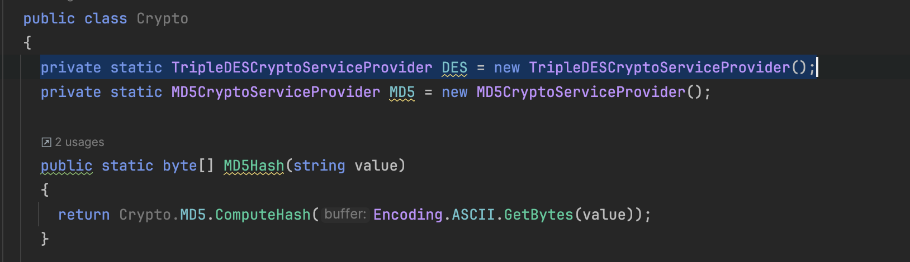

# Kryptering I examcookie

Har du nogle sinde hørt om super-computere? Måske ikke, dette er en computer der er super hurtig til en specifik ting.
Hvis de bliver udviklet vil de kunne afsløre næsten alle nuværende krypterings algoritmer, og især de svage.

Dette program ExamCookie bruger selvføgelig et godt et... ik? Måske ikke.
På understående billede kan vi se en dårlig måde at kryptere på, til et program der burde være sikkert.



Dette er MD5 hashing, og dette er en krypterings algoritme der kan knægges på min egen computer. Altså ikke en super computer.

Som vi også kan se i den understående kode snip, bruges der TripleDES og MD5 enkryptering, disse er set som "insecure" [1]
```cs
private static TripleDESCryptoServiceProvider DES = new TripleDESCryptoServiceProvider();
private static MD5CryptoServiceProvider MD5 = new MD5CryptoServiceProvider();
```

Her burde der bruges AES og SHA-256.


“MD5 - Wikiwand.” Accessed January 14, 2025. https://www.wikiwand.com/en/articles/MD5.

TheCyberSalad. “MD5 Is Insecure: Why This Hashing Algorithm Puts Your Files at Risk.” Medium (blog), December 23, 2024. https://medium.com/@thecybersalad/md5-is-insecure-why-this-hashing-algorithm-puts-your-files-at-risk-0423e27c2e9f.
